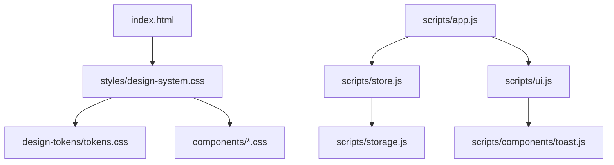
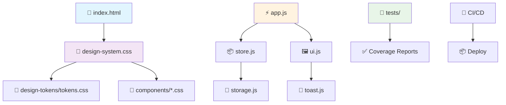

# 🏗️ Architecture technique – V5 Documentation

## Vue d’ensemble

Le projet s’appuie sur une architecture modulaire, orientée accessibilité et maintenabilité, avec séparation claire entre styles, scripts, composants et documentation.

### Schéma global

## Structure des dossiers

- **index.html** : Point d’entrée principal, charge les styles et scripts.
- **components/** : Styles CSS des composants UI (Button, Card, Toast).
- **design-tokens/** : Variables CSS pour couleurs, typographie, espacements.
- **scripts/** : Logique JavaScript (app, gestion d’état, UI, composants).
- **styles/** : Fichiers CSS globaux et design system.
- **tests/** : Tests unitaires, configuration CI, qualité.
- **docs/** : Documentation complète, guides, schémas, FAQ.

## Flux de données

- **app.js** orchestre l’initialisation, la gestion d’état (store.js), la persistance (storage.js), et l’UI (ui.js).
- Les composants (ex: toast.js) sont découplés et réutilisables.
- Les tokens CSS sont injectés dans tous les styles via `design-system.css`.

### Flux détaillé

## Gestion d’état

- **store.js** : Centralise l’état de l’application (mode sombre/clair, notifications, etc.).
- **storage.js** : Persiste l’état dans le localStorage de façon sécurisée.

## Design tokens & thèmes

- **tokens.css** : Définit toutes les variables CSS (couleurs, typographie, espacements).
- **design-system.css** : Importe les tokens et applique les styles globaux, gère le dark/light mode.

## Architecture CSS

- **main.css** : Styles globaux de base.
- **design-system.css** : Styles du design system, thèmes, import des tokens.
- **components/*.css** : Styles spécifiques à chaque composant, respectant les tokens.

## Pipeline CI/CD

- **Vite** : Build rapide, hot reload.
- **Vitest** : Tests unitaires.
- **Prettier/ESLint** : Qualité et formatage du code.
- **GitHub Actions** : CI/CD automatisé, déploiement, coverage.

---

Pour plus de détails, consultez la [Table des matières](./SUMMARY.md).
